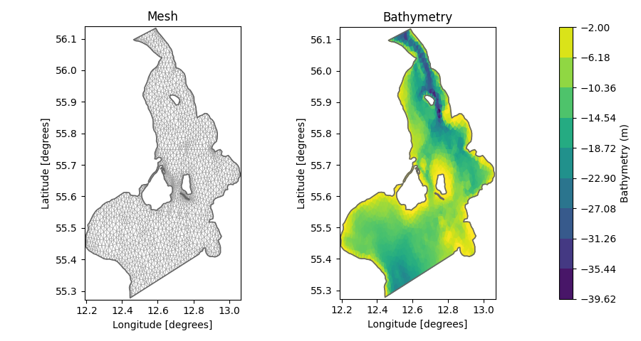
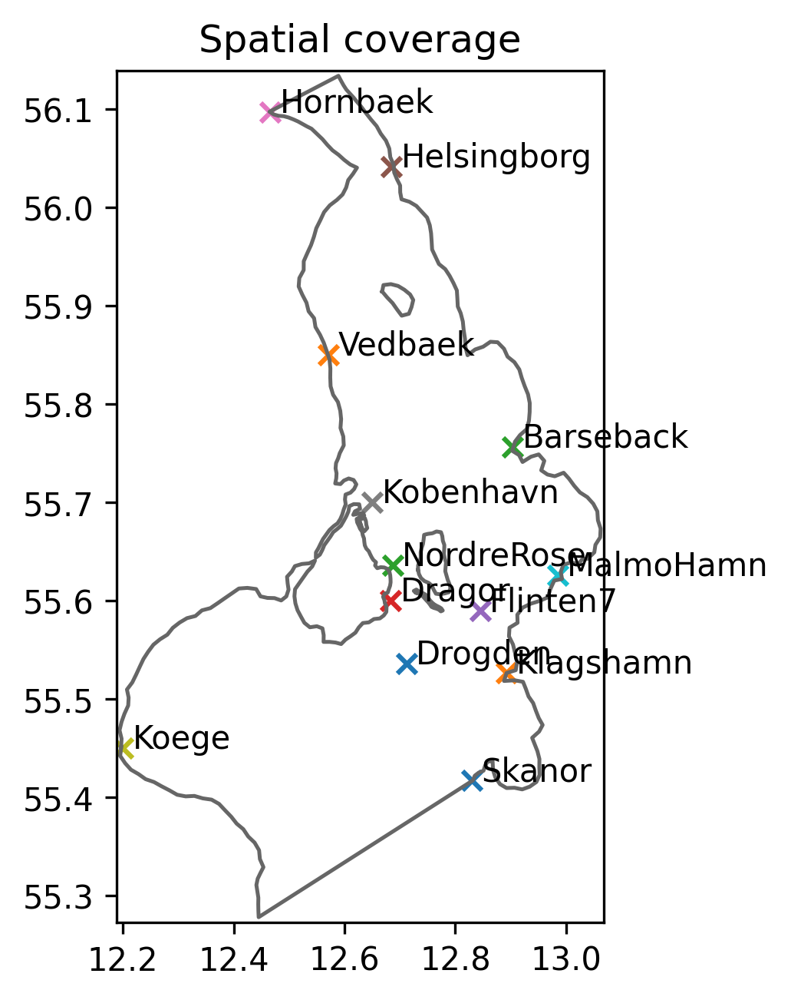
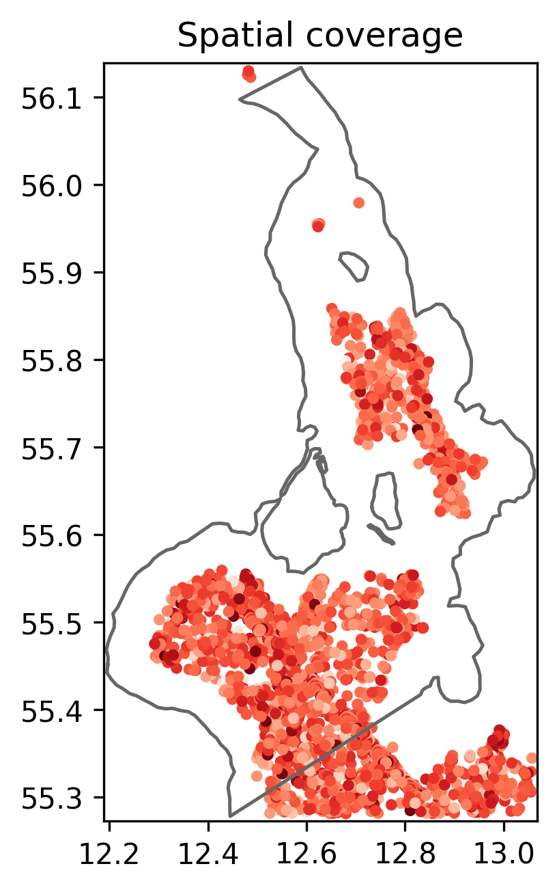
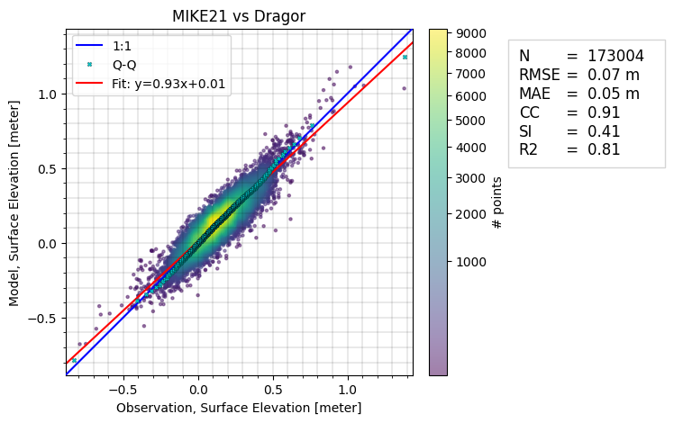
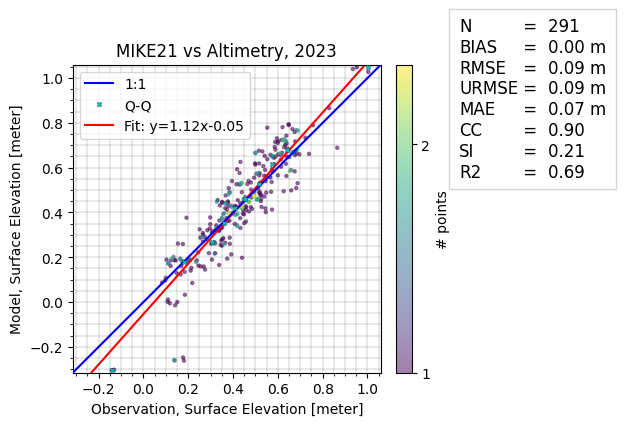

# Hydrodynamic model of Øresund
This README file contains practical information and background information on the data. To view this markdown file in VScode, use ctrl+shift+v. The data can be cited as:

DHI. (2024). Hydrodynamical model of Øresund: MIKE model setup, outputs and validation material (1.0) [Data set]. Zenodo. doi: [10.5281/zenodo.14160710](10.5281/zenodo.14160710)

See the [license](license.txt) for information on using the data.

## Folder structure

The repository is organized in the following way

- README.md
- License
- model
    + MIKE model setup file (.m21fm)
    + log file (.log)
- input
    + Forcing (wind, air pressure)
    + Boundary conditions
    + mesh file (.mesh)
- observations
    + files containing observational data for model validation
- code
    + Jupyter notebook containing loading instructions 
    + Jupyter notebook for model validation using observations
    + An environment file (.txt)
- figures
    + figures generated by notebooks

Separately from the current repository, you can find the output file (in Zenodo).

- output
    + simulation data from running the MIKE model (.dfsu and .dfs0)

## Background
This folder contains data for a simulation with the MIKE 21 Flow Model FM in the Øresund Strait, which is the strip of water between Denmark and Sweden. The simulation is primarily driven by the surge component introduced at the two open boundarys (one in North and one in South). The meterological forcings such as air pressure and wind have only a minor effect on the result. The tidal range of the area is 10-20 cm. 

This repository supplies the setup files, input data and observation data, as well as simulation data from this numerical model. The simulation data is available in Zenodo. The data supplied in this repository covers the period from 2014-01-01 to 2023-12-31. There is a spin-up period, so it is recommended to remove the first 10 days of the simulation data. 

## The MIKE 21 Flow Model FM
MIKE 21 Flow Model FM is a modelling system based on a flexible mesh approach. The modelling system has been developed for applications within oceanographic, coastal and estuarine environments. The model is based on the numerical solution of the two-dimensional shallow water equations - the depth-integrated incompressible Reynolds averaged Navier-Stokes equations. More information can be found [in the documentation here](https://manuals.mikepoweredbydhi.help/latest/Coast_and_Sea/MIKE_FM_HD_2D.pdf).

For modelling Øresund, the first step is to produce the flexible mesh and interpolate with bathymetry data. The mesh consists of triangles and quadrilateral elements in a higher resolution close to the coast than on deeper waters, and for each node a depth value is given based on bathymetry data. The result is shown in the figure below. There is a total of 3320 elements covering the area of appr. 2000 $km^2$.

The second step is to perform a simulation with the MIKE software, while supplying the following data for driving the model:
- the water levels and current velocities on the North boundary
- the water levels and current velocities on the South boundary
- wind velocities and air pressure in the domain.

This data can be found in the [/input](/input) folder. Furthermore, some parameters of the model, e.g. bed resistance constant, is calibrated by comparing the model simulations to observational data. 

The outputs of the model are given as a timeseries for each mesh element on the spatial domain containing the variables:
- the surface elevation,
- the u and v components of the current velocity.

This data can be found as a separate file in [Zenodo](10.5281/zenodo.14160710). Once a simulation has been run, a log file will be generated. The log-file for the benchmark simulation is found in the folder [/model](/model), and it contains information on the parameters used and the time spent on the simulation. 

Since all data, including output from a simulation, is given, it is not necessary to run the MIKE simulation. However, it is possible, since a setup file is supplied as well as all of the input data. Running the MIKE software requires a license. Read more about obtaining a license [here](https://www.dhigroup.com/technologies/mikepoweredbydhi/pricing) and about academic licensing [here](https://www.dhigroup.com/technologies/mikepoweredbydhi/pricing/academic-licenses). If you already have a license, a step-by-step guide for running simulations can be found [here](https://manuals.mikepoweredbydhi.help/latest/Coast_and_Sea/MIKE_FM_HD_Step_By_Step.pdf).

The input and output data is given as dfs files. These files can be processed using the mikeio package developed by DHI. Find more information on the data types and the mikeio API on the [documentation website here](https://dhi.github.io/mikeio/).

## Model validation
The modelskill package developed at DHI can be used for validating the model outputs by comparing to observational data. Find more information in [the documentation here](https://dhi.github.io/modelskill/). 

The model outputs are validated by comparison to observational data from measurement stations in Øresund and altimetry data from satellites. This is done in the notebook [code/model_validation.ipynb](code/model_validation.ipynb). The leftmost figure below shows the location of the measurement stations, and the rightmost figure shows the coverage of the altimetry data.

Below, the comparison between the observational data from one such measurement station and MIKE 21 is shown first followed by the comparison to the altimetry data. The production of these and many more plots is found in the notebook [code/model_validation.ipynb](code/model_validation.ipynb). 

## Data sources
Several data sources contribute to this case. They are outlined below.

| Data   | Source|  Citation | License | 
| -------- | ------- | ------- | ------- |
| Mesh | The mesh is developed by DHI. | Repository citation, see [the top](#Hydrodynamical-model-of-Øresund) | [CC BY 4.0](https://creativecommons.org/licenses/by/4.0/) |
| Bathymetry | The bathymetry is based on the EMODnet Bathymetry Digital Terrain Model (DTM) 2020. | EMODnet Bathymetry Consortium (2020). EMODnet Digital Bathymetry (DTM 2020).EMODnet Bathymetry Consortium [https://doi.org/10.12770/bb6a87dd-e579-4036-abe1-e649cea9881a](https://doi.org/10.12770/bb6a87dd-e579-4036-abe1-e649cea9881a) | [CC BY 4.0](https://creativecommons.org/licenses/by/4.0/) |
| Wind and Air pressure | The ERA5 reanalysis of globate climate. Produced by Copernicus Climate Change Service at ECMWF. | Hersbach, H., Bell, B., Berrisford, P., Biavati, G., Horányi, A., Muñoz Sabater, J., Nicolas, J., Peubey, C., Radu, R., Rozum, I., Schepers, D., Simmons, A., Soci, C., Dee, D., Thépaut, J-N. (2023): ERA5 hourly data on pressure levels from 1940 to present. Copernicus Climate Change Service (C3S) Climate Data Store (CDS), DOI: 10.24381/cds.bd0915c6 (Accessed on 19-12-2023) | See full license [here](https://apps.ecmwf.int/datasets/licences/copernicus/). Excerpt: "Access to Copernicus Products is given for any purpose in so far as it is lawful, whereas use may include, but is not limited to: reproduction; distribution; communication to the public; adaptation, modification and combination with other data and information; or any combination of the foregoing." |
| Boundary condition | The boundary condition input is obtained from DHI's Danish Waters and Baltic Sea (DKBS) model, which is a 3-dimensional hydrodynamic model. | DHI, ”Water levels and currents on the boundaries of Øresund from the DKBS hydrodynamical model” (2024). | [CC BY 4.0](https://creativecommons.org/licenses/by/4.0/) |
| Sea levels in measurement stations | Retrieved through the [Copernicus Marine Service (CMEMS, or Copernicus Marine Environmental Monitoring Service)](https://www.copernicus.eu/en/copernicus-services/marine). More specifically, the open download service from the Marine Data Store is used. It can be found [here](https://data.marine.copernicus.eu/product/INSITU_BAL_PHYBGCWAV_DISCRETE_MYNRT_013_032/download?dataset=cmems_obs-ins_bal_phybgcwav_mynrt_na_irr_202311--ext--history). | Copernicus Marine Service, "Baltic Sea- In Situ Near Real Time Observations" (2024), [https://doi.org/10.48670/moi-00032](https://doi.org/10.48670/moi-00032). | See full license [here](https://marine.copernicus.eu/user-corner/service-commitments-and-licence). Excerpt: "The Licensee is hereby granted a worldwide, non exclusive, royalty free, perpetual licence, (subject to the terms and conditions of this agreement) to: (a) make and use such reasonable copies of Copernicus Marine Service Products for internal use and back up purposes; (b) modify, adapt, develop, create and distribute Value Added Products or Derivative Work from Copernicus Marine Service Products for any purpose; (c) redistribute, disseminate any Copernicus Marine Service Product in their original form via any media." |
| Current velocities in measurement stations | Retrieved from SMHI (Meteorological and Hydrological Institute of Sweden). The data is subsampled using a rolling median to get half hour observations, and then the u and v components are calculated from the speed and directions. | Meteorological and Hydrological Institute of Sweden, "Oceanographic observations" (2024), URL: [https://www.smhi.se/en/services/open-data/oceanographic-observations](https://www.smhi.se/en/services/open-data/oceanographic-observations) (accessed: 2024-11-18) | [CC BY 4.0 license](https://creativecommons.org/licenses/by/4.0/legalcode.en) |

### Altimetry data

The altimetry data is extracted from a range of different sources. The data is based on satellite observations, and the data is downloaded using [DHI's services for marine observation data](https://altimetry.dhigroup.com/). The water level measurements are processed by centering around zero (subtracting the mean). Data sources:

| Satellite name    | Owner|  Link |
| -------- | ------- | ------- |
| Sentinel-3A (3a) | European Space Agency (ESA) |  [https://sentiwiki.copernicus.eu/web/s3-altimetry-instruments](https://sentiwiki.copernicus.eu/web/s3-altimetry-instruments) |
| Sentinel-3B (3b) | European Space Agency (ESA) | [https://sentiwiki.copernicus.eu/web/s3-altimetry-instruments](https://sentiwiki.copernicus.eu/web/s3-altimetry-instruments) |
| Sentinel-6A (6a) | European commission, ESA, EUMETSAT, NASA and NOAA |  [https://sentinels.copernicus.eu/web/sentinel/missions/sentinel-6/data-products](https://sentinels.copernicus.eu/web/sentinel/missions/sentinel-6/data-products) |
| CryoSat-2 (c2) | European Space Agency (ESA) |  [https://earth.esa.int/eogateway/catalog/cryosat-products](https://earth.esa.int/eogateway/catalog/cryosat-products)  |
| SARAL (sa) | French National Space Agency (CNES) and Indian Space Research Organisation (ISRO) | [https://podaac.jpl.nasa.gov/dataset/ALTIKA_SARAL_L2_OST_XOGDR](https://podaac.jpl.nasa.gov/dataset/ALTIKA_SARAL_L2_OST_XOGDR) |
| Jason-2 (j2) | National Aeronautics and Space Administration (NASA) and French National Space Agency (CNES) | [https://podaac.jpl.nasa.gov/OSTM-JASON2](https://podaac.jpl.nasa.gov/OSTM-JASON2) |
